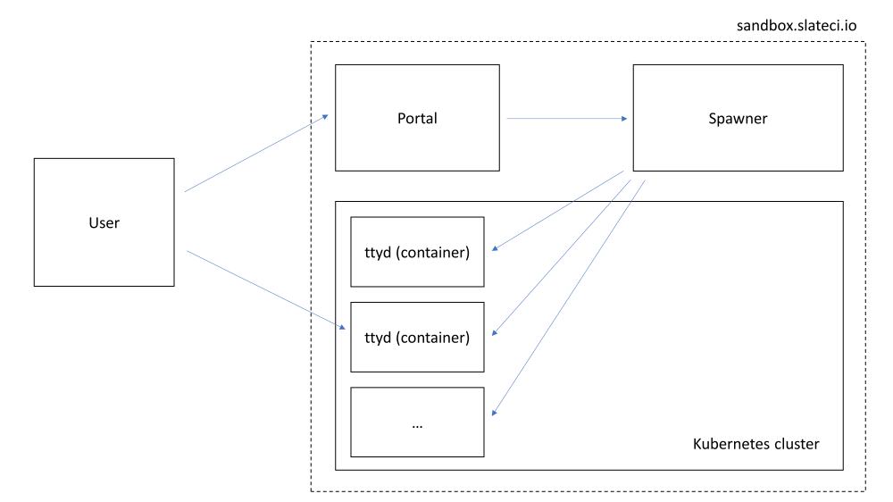

# SLATE Sandbox Overview
The SLATE Sandbox is an application run by the SLATE Core Team to allow members of the community to test slate from a web browser.

It is made of several components as shown in this architecture diagram:

All components are installed on sandbox.slateci.io. The flow is the following:
* User logs to the portal using his credentials
* The portal asks the spawner to start a ttyd container for the user, if it is not yet running
* The ttyd container provisions a web server on a specific port assigned to the user, that allows to run a terminal window within the container over http
* The portal presents a page with a frame that opens the connection to the correct ttyd web port for the specific user
* User interact with the ttyd web service directly

The components and their source location:
* The portal ([Source](https://github.com/slateci/sandbox-portal)) is the entry point for the user. It is a web application written in python and html. It is a modification of the [Modern Research Data Portal](https://github.com/globus/globus-sample-data-portal), sample Globus application. See below for more information
* The spawner ([Source](https://github.com/slateci/sandbox-spawner)) is an internal service that manages each user container instance on the kubernetes cluster. It is a C++ application. See the source repo for more information.
* The ttyd application ([Source](https://github.com/slateci/slate-ttyd)) is the application that allows to access to a terminal windows through http. It is a fork of [ttyd](https://github.com/tsl0922/ttyd/) to accomodate the security requirements. See the source repo for more information.
* The ttyd container ([Source](https://github.com/slateci/container-ttyd)) packages the ttyd application into a Docker container. See the source repo for more information.

The overall installation information can be found [here](https://github.com/slateci/sandbox-spawner/blob/master/resources/deployment.md).

# SLATE Sandbox Portal

This repository contains the source code for the portal. This is a modified version of the [Modern Research Data Portal](https://github.com/globus/globus-sample-data-portal), sample Globus application. See below for more information. The original readme file of the forked version can be found [here](MRDP-README.md).

# Checkmk monitoring

Checkmk is configured to test whether the main website page is online.
